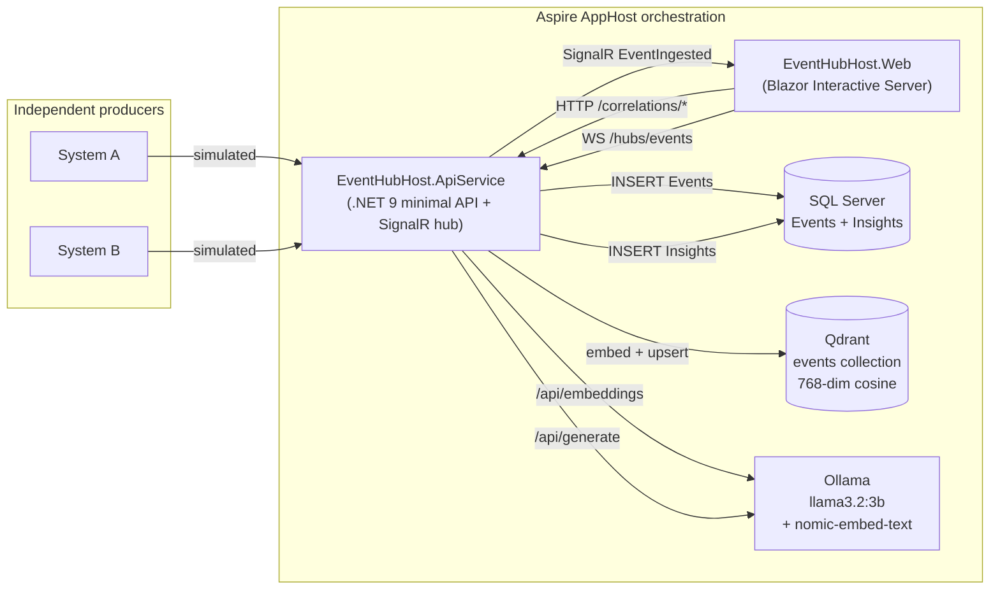
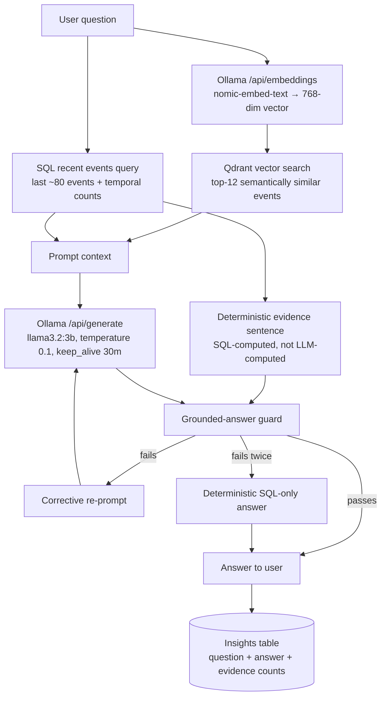

# EventHubHost

A .NET 9 / .NET Aspire reference implementation of a **centrally hosted, LLM-based event correlation system** that monitors events from multiple independent source systems and uses a self-hosted LLM (Ollama) — augmented with a vector database (Qdrant) and a relational store (SQL Server) — to detect and explain correlation patterns between them.

The defining constraint of the problem is that **the source systems do not share a correlation ID, trace ID, or transaction ID**. Correlations must be inferred from event timing, event types, and observed counts. The solution is therefore deliberately built as a *reasoning layer over windowed, normalised event batches*, not a join over shared keys.

---

## What the solution is trying to achieve

1. **Ingest events from independent producers** (`System A`, `System B`) into a single hub.
2. **Persist every event durably** in SQL Server so the dataset is auditable, replayable, and queryable with deterministic SQL.
3. **Embed every event into a vector store** (Qdrant) so that historical events can later be retrieved by *semantic similarity* to a user's question, not just by time window.
4. **Stream every event to the UI in real time** over SignalR.
5. **Answer correlation questions** ("does System B's event 9002 tend to follow System A's event 2?") using a *Retrieval-Augmented Generation* (RAG) pipeline:
   - A deterministic SQL query supplies the temporal evidence (counts, time-window matches, exact pairs).
   - A vector search supplies semantically similar historical events.
   - An LLM (Ollama, `llama3.2:3b`) writes the natural-language answer **constrained by the SQL-computed evidence**.
6. **Persist every prompt and answer** in a SQL `Insights` table so the conversation history is a first-class artifact.
7. **Fail safely**: if the LLM is unavailable, the API returns a deterministic locally-computed summary; if the vector store is unavailable, the API still answers using SQL temporal context only.

The system is intentionally biased toward *grounded* answers. The LLM is not allowed to invent counts or timestamps — its output is rejected and rewritten by a verifier if it omits the deterministic evidence sentence or uses forbidden words like *"statistically"*, *"proves"*, or *"correlation key"*.

---

## High-level architecture



A more detailed component diagram, the Ask sequence diagram, and the RAG retrieval flow are in [docs/architecture.md](docs/architecture.md).

---

## Why a vector database is relevant for the Ollama LLM

A self-hosted small LLM (here `llama3.2:3b`) has two hard constraints that a vector database directly addresses:

1. **The context window is small and expensive to fill.** We cannot stuff "every event ever observed" into the prompt. We need to select the *most relevant* slice of history for each question.
2. **The LLM has no memory between calls.** Anything the model is allowed to "know" about historical events must be supplied in the prompt for that specific call.

A naive solution is to always supply the most recent N rows from SQL. That works for *temporal* questions ("what happened in the last 5 minutes?") but fails for *semantic* questions ("have we ever seen a payment-rejection burst pattern like this one?"). Recency is the wrong filter — the relevant historical events may be hours, days or weeks old.

The vector database fills exactly that gap:

| Concern | SQL Server | Qdrant (vector DB) |
|---|---|---|
| What is it good at? | Exact filters, counts, time-window joins, audit | Similarity search by *meaning* |
| What does it answer? | "How many type-2 events happened in the last hour?" | "Which historical events look semantically similar to this question?" |
| Indexing key | Time, source system, event type | A 768-dim embedding vector of the event text |
| Role in this solution | Source of truth + deterministic temporal evidence | Long-term semantic memory for the LLM |

### How the two stores cooperate during an Ask

When the user asks a question, the API performs **Retrieval-Augmented Generation (RAG)** with two parallel retrieval channels and one deterministic verifier:



So the vector DB is **not** there to store the answer; it is there to give the LLM the *right facts to cite* — the historical events most semantically related to the question — alongside the deterministic temporal facts that SQL provides. Without it, the LLM would be reasoning over an arbitrary window of recent rows and would have no way to recall older but relevant patterns. With it, the LLM behaves like a junior analyst with access to a well-indexed evidence locker.

The embedding model (`nomic-embed-text`, 768-dim) runs in the **same Ollama container** as the chat model, so the operational footprint stays at one self-hosted runtime. Embeddings are computed once at ingestion time and once per question.

---

## Why SQL Server is also retained

The vector DB is excellent at *similarity*, but it is the wrong tool for two responsibilities the system needs:

1. **Deterministic temporal evidence.** The phrase *"N System A type 2 events were followed by System B type 9002 within S seconds"* must be a SQL `COUNT(...)` over the events table — not something the LLM is allowed to invent. The grounded-answer guard rejects any LLM response that omits this sentence verbatim.
2. **Audit trail.** Every prompt and every LLM answer is written to the `Insights` table so the conversation history is queryable, exportable, and preservable independently of the UI session.

SQL Server is therefore the *system of record*; Qdrant is *long-term semantic memory for the model*; Ollama is the *reasoning layer*.

---

## Solution structure

| Project | Purpose |
|---|---|
| [EventHubHost.AppHost](EventHubHost.AppHost/AppHost.cs) | Aspire orchestration: SQL Server, Qdrant, Ollama, API, Web. Defines volumes and inter-service env vars. |
| [EventHubHost.ApiService](EventHubHost.ApiService/Program.cs) | Minimal API + SignalR hub. Owns ingestion, persistence, vector upsert, RAG, LLM client, insight history. |
| [EventHubHost.Web](EventHubHost.Web/Program.cs) | Blazor Interactive Server UI. Consumes the API over Aspire service discovery and the SignalR hub. |
| [EventHubHost.ServiceDefaults](EventHubHost.ServiceDefaults/Extensions.cs) | Shared OpenTelemetry, health checks, default HTTP resilience handler. |
| [EventHubHost.Tests](EventHubHost.Tests/WebTests.cs) | xUnit v3 + `Aspire.Hosting.Testing` integration tests that bring up the full topology and assert end-to-end behaviour including RAG and insight history. |

### Key runtime resources (defined in AppHost)

| Resource | Image | Port | Volume |
|---|---|---|---|
| `sqlserver` / `eventdb` | Aspire SQL Server | dynamic | `eventhubhost-sqlserver-data` |
| `vectordb` | `qdrant/qdrant:v1.13.4` | 6333 | `eventhubhost-qdrant-data` |
| `llm` | `ollama/ollama:0.5.7` | 11434 | `eventhubhost-ollama-data` |

---

## Long-thinking and timeout policy

A small self-hosted LLM with vector retrieval can take many seconds — sometimes minutes — to produce a grounded answer, especially on the first call after a cold start (model load) or after a model pull. The user has explicitly accepted long thinking, so the policy is:

- `OllamaCorrelationClient` and `OllamaEmbeddingClient` use their **own** `HttpClient` instances (not DI typed clients) with `Timeout = 30 minutes` — bypassing the default Aspire `AddStandardResilienceHandler`, which silently caps every typed `HttpClient` at 30 seconds.
- Every `/api/generate` and `/api/embeddings` call sends `keep_alive: "30m"` so Ollama keeps both models warm in memory between calls.
- The Web → API typed `HttpClient` overrides `AttemptTimeout`, `TotalRequestTimeout`, and `CircuitBreaker.SamplingDuration` to 30 minutes / 60 minutes respectively.
- The integration test resilience handler is overridden to the same scale so multi-container warm-up does not get cancelled at 30 s.

This is the single most common failure mode when wiring an LLM into Aspire and is documented in detail in [docs/architecture.md](docs/architecture.md).

---

## Running the solution

Prerequisites: .NET 9 SDK, Docker Desktop (for SQL Server, Qdrant, and Ollama containers).

```pwsh
dotnet run --project .\EventHubHost.AppHost\EventHubHost.AppHost.csproj
```

The Aspire dashboard will open. The `webfrontend` resource exposes the Blazor UI; the `apiservice` resource exposes `/correlations/status`, `/correlations/query`, `/correlations/insights`, `/scenarios/type2`, and the SignalR hub at `/hubs/events`.

To run the integration tests (these spin up the full Aspire topology, pull the Ollama models, and execute a real LLM call — expect 2–5 minutes once images and models are cached):

```pwsh
dotnet test .\EventHubHost.Tests\EventHubHost.Tests.csproj --logger "console;verbosity=normal"
```

---

## Further reading

- [docs/architecture.md](docs/architecture.md) — detailed component diagram, Ask sequence diagram, RAG retrieval flow, grounded-answer guard, and operational notes.
- [docs/improvements.md](docs/improvements.md) — the seven improvement areas implemented on top of the baseline (streaming answers, anomaly-triggered insights, hybrid retrieval, insight memory, golden-question harness, telemetry, GPU toggle) and how to enable each.
- [llm-event-correlation-context.md](llm-event-correlation-context.md) — the original design context document used to seed the implementation.
