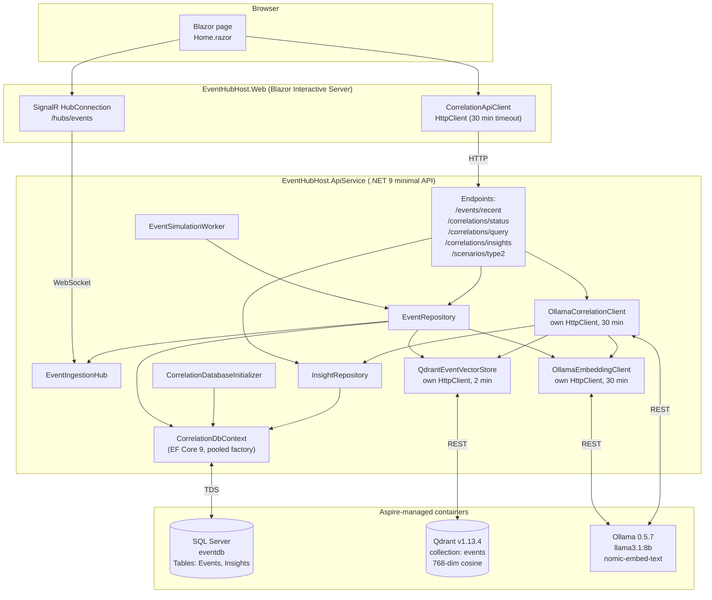
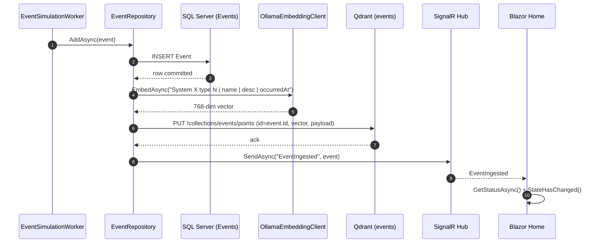
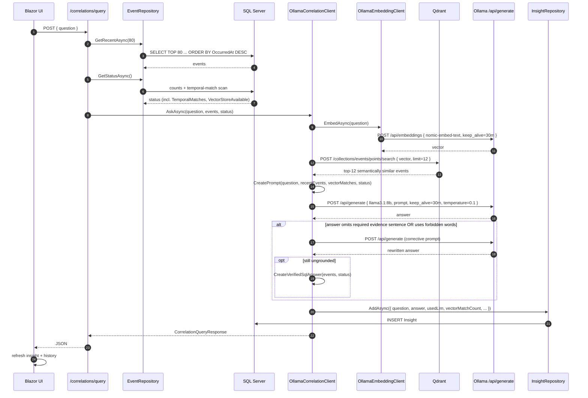

# EventHubHost — Architecture deep-dive

This document complements the [README](../README.md) with the diagrams and design notes an architect needs to evaluate, extend, or operate the solution.

---

## 1. Container / component diagram

### Notes

- **`OllamaCorrelationClient`, `OllamaEmbeddingClient`, and `QdrantEventVectorStore` deliberately construct their own `HttpClient`**. They are *not* registered with `AddHttpClient<T>()`, because Aspire's `AddServiceDefaults` attaches `AddStandardResilienceHandler` to every typed client and that handler caps every request at ~30 seconds, which is incompatible with LLM call latencies and embedding model cold-pulls.
- **`EventRepository` is the only writer to SQL `Events` and to Qdrant.** This guarantees that every event reaches both stores in the same order, with the SQL row written first as the system of record and the vector upsert as a best-effort follow-up that logs but does not throw on failure.
- **`SignalR EventIngested` is broadcast last**, after both persistence steps, so a UI that reacts to the event sees a state that is consistent with `/events/recent` and `/correlations/status`.

---

## 2. Ingestion sequence

A vector-store failure between steps 4 and 6 is logged but does not roll back the SQL row or block the SignalR broadcast. The system can therefore degrade gracefully to "SQL only", and a later operational task can re-embed missing rows.

---

## 3. Ask sequence (RAG)

### Key invariants

- The prompt always contains:
  - the deterministic temporal summary computed by SQL,
  - the exact matched-pair examples computed by SQL,
  - up to 30 most recent SQL events (temporal context),
  - up to 12 vector-retrieved semantically similar events (semantic context).
- The LLM's answer is rejected unless it contains the literal sentence
  `Evidence: {N} System A type 2 event(s) were followed by System B type 9002 within {S} seconds`
  and avoids the forbidden words `statistically`, `probability`, `proves`, `proof`, `confidence`, `correlation key`.
- If the LLM cannot be coaxed into a grounded answer, the API returns a deterministic SQL-only answer with `UsedLlm = false`. **A failure of the LLM never produces a wrong answer — it produces a less eloquent right one.**
- Every Q+A row is recorded in SQL `Insights` regardless of which path produced the answer.

---

## 4. Why two stores: a decision matrix

| Question the system must answer | Store that owns the answer | Why |
|---|---|---|
| "Insert this new event durably." | SQL `Events` | ACID, audit, replay, schema. |
| "How many type-2 events happened in the last hour?" | SQL `Events` | Exact counts and time-window joins are SQL's home turf. |
| "Show me events that look semantically similar to *this question*." | Qdrant `events` | Cosine similarity over text embeddings; cannot be expressed in SQL. |
| "Has the user asked something like this before?" | SQL `Insights` (could be augmented by vector search later) | Audit + history. |
| "Is the LLM allowed to claim N matches?" | SQL `Events` (deterministic count) | The LLM cannot be trusted to count. |
| "Stream new events to connected browsers." | SignalR (transient) | Not a store concern. |

The **vector DB does not duplicate SQL** — it answers a question SQL cannot answer at all (semantic similarity). The **SQL DB does not duplicate the vector DB** — it provides ground-truth counts and an audit trail the vector DB cannot provide.

---

## 5. Operational notes

### 5.1 The Aspire resilience-handler trap

`AddServiceDefaults` (in `EventHubHost.ServiceDefaults`) attaches `AddStandardResilienceHandler` to every typed `HttpClient` registered via `AddHttpClient<T>()`. That handler defaults to ~30-second attempt and total-request timeouts. When wired in front of an LLM, it produces an `OperationCanceledException` (often surfaced as a Polly `TimeoutRejectedException`) at exactly 30 seconds — long before the LLM has a chance to think.

The mitigations used in this codebase:

| Component | Mitigation |
|---|---|
| `OllamaCorrelationClient` | `new HttpClient { Timeout = 30 min }`; not registered with `AddHttpClient<T>()`. |
| `OllamaEmbeddingClient` | Same pattern. |
| `QdrantEventVectorStore` | Same pattern (`Timeout = 2 min`). |
| Web → API `CorrelationApiClient` | Registered with `AddHttpClient<T>()` *and* `AddStandardResilienceHandler(...)` with `AttemptTimeout`, `TotalRequestTimeout`, and `CircuitBreaker.SamplingDuration` raised to 30/30/60 minutes. |
| Integration tests | `appHost.Services.ConfigureHttpClientDefaults(b => b.AddStandardResilienceHandler(o => { ...30 min... }))`. |

### 5.2 Ollama warm-up

The first `/api/generate` call after a container start can take a long time because the model is loaded into memory on demand. Subsequent calls are fast as long as `keep_alive` is honoured. Every call sends `keep_alive: "30m"` to keep both `llama3.1:8b` and `nomic-embed-text` resident.

### 5.3 SQL schema upgrade strategy

`CorrelationDatabaseInitializer` calls `EnsureCreatedAsync` (which only creates a new database) and then runs an idempotent `CREATE TABLE IF NOT EXISTS Insights` script. This handles the realistic case where a developer reuses an existing `eventhubhost-sqlserver-data` volume from before the `Insights` table existed. For production, this should be replaced with EF Core migrations.

### 5.4 Vector store schema

Collection `events`, vector size 768, distance `Cosine`. Each point is `{ id = event.Id, vector, payload = { SourceSystem, EventType, Name, Description, OccurredAt } }`. The collection is created lazily by `QdrantEventVectorStore.EnsureCollectionAsync` on first use.

### 5.5 Failure modes and behaviour

| Failure | Behaviour |
|---|---|
| Qdrant container down | Status reports `VectorStoreAvailable=false`. Ingestion logs a warning; SQL row still written; SignalR still broadcasts. RAG falls back to SQL-only context. |
| Ollama container down | `OllamaCorrelationClient` retries 3×; on final failure returns `CreateFallbackAnswer(...)` with `UsedLlm=false`. The Q+A is still recorded in `Insights`. |
| Embedding model not yet pulled | `OllamaEmbeddingClient` issues `/api/pull` once on the first 404, then retries. |
| Chat model not yet pulled | Symmetric mechanism inside `OllamaCorrelationClient`. |
| SignalR drops | Blazor reconnects via `WithAutomaticReconnect()`. |
| The Blazor page does not update on new events | The SignalR callback is a non-UI handler — it must marshal back via `InvokeAsync(...)` *and* call `StateHasChanged()` explicitly. The `Home.razor` handler does both. |

---

## 6. Extension points

- **Real producers**: replace `EventSimulationWorker` with adapters that consume from your event broker (Service Bus, Event Hubs, NServiceBus, Kafka). The repository contract (`EventRepository.AddAsync`) is unchanged.
- **More source systems**: the prompt and verifier are written for "System A type 2 → System B type 9002". Generalising to N systems and N hypotheses requires lifting the hard-coded constants in `CorrelationEventFactory` and the evidence sentence in `IsGroundedAnswer`.
- **Better retrieval**: today the question is embedded with `nomic-embed-text` and searched against the `events` collection. A hybrid retrieval (BM25 + vector) or a second `Insights` collection would let the system retrieve "similar past questions" alongside "similar past events".
- **Production schema management**: replace `EnsureCreatedAsync` + idempotent DDL with EF Core migrations.
- **Authn/Z**: nothing in this PoC is authenticated. Front the API and the SignalR hub with the Aspire-recommended OIDC integration before production use.
